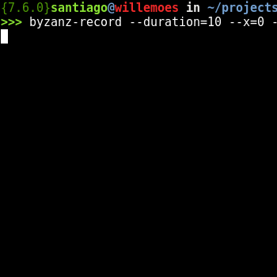

# Choppycamp

> Game in which some bots have to pick most of the laptops or beer chops to win.

This is a project done in the pycamp held at Baradero 2017.

## Installation
`pip install -r requirements.txt`

## To play with default parameters
`python choppycamp.py`

## Example using custom parameters
`python choppycamp.py --player-x priority_bot --player-y normal_bot --fps 10 --max-turns 1000 --rooms 4`

## Help
`python choppycamp.py --help`

## Notes

* Remember the game was written in python 3